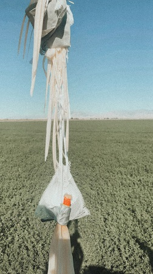

# High Altitude Balloon Project
##### Contents
1. [Summary](#user-content-summary)
2. [Balloon Payload](#user-content-balloon-payload)
3. [Ground Tracking Station](#user-content-ground-tracking-station)
4. [Software](#user-content-software)
5. [Final Data](#user-content-final-data)

### Summary
During the summer of 2020 I put together a high altitude balloon project. This was my first project like this and my goal was to get a picture of the curvature of the Earth. I was finally able to launch the balloon on Sept. 5th, 2020 and got the picture I was hoping for. You can read a more detailed summary in my [technical summary document](Project Summary.pdf).

Photo of Earth at 25.5km

### Balloon Payload
The balloon payload was packed into a circular styrofoam ball to provide insulation from the cold. Everything sat pretty compact. I cut out pockets in the styrofoam for each component to sit in comfortably. 

The LoRA antenna came out of the bottom of the styrofoam ball and the GPS antenna came out the top.

The balloon payload ran the [balloon flight controller software](balloon-controller) that I build on the Arduino MKR WAN 1310. The software ran a loop taking pictures every minute and sending back GPS position updates every 5 seconds. 

|Hardware|Description| Price|
| ------- | ---------------- | ------|
| [Arduino MKR WAN 1310](https://store.arduino.cc/usa/mkr-wan-1310) | Microcontroller that ran the balloon payload components and sent data back to ground | $38 |
| [Neo-6M u-blox compatible GPS](https://www.amazon.com/gp/product/B084MK8BS2/) | GPS unit that was capable of running in **high altitude mode** | $13 |
| [Arducam OV2640 Camera](https://www.amazon.com/gp/product/B012UXNDOY/) | 2MP Arducam Camera. They also sell a 5MP version | $26 
| [SD card module](https://www.amazon.com/Adapter-Reader-interface-driver-Arduino/dp/B01MSNX0TW) | Important for storing images and data logs | $10 
| [AAA Battery Pack](https://www.adafruit.com/product/727) | The JST connector was a little too big to fit the MKR WAN 1310 so shaving may be required | $2 
| [3 x AAA Lithium Batteries](https://www.amazon.com/gp/product/B06ZYWKBRB) | Important to get **Lithium** batteries, not lithium ion. Lithium is rated for much colder temps | $14

 
### Ground Tracking Station
The ground tracking station consisted of a Arduino MKR WAN 1300 and a laptop. It was the ground station's job to receive GPS position updates from the balloon. 

The MKR WAN 1300 received used [a simple Arduino sketch](balloon-receiver) to listen for position updates. When received, the position updates were fed through the laptop and [plotted in real time on Google Maps.](balloon-tracker-client)  

|Hardware|Description| Price|
| ------- | ---------------- | ------|
| [Arduino MKR WAN 1300](https://store.arduino.cc/usa/mkr-wan-1300) | Used the MKR WAN 1300 because that's what was handy. MKR WAN 1310 would also work here. | $40 |
| Laptop | Any laptop capable of running Node.js will work | --

### Software
I developed various different software packages to get this project to work. All of them were developed specifically for this project and are contained in this repo.
###### Flight Control & Tracking

| Software | Description |
| ------- | ---------------------|
| [balloon-controller](balloon-controller) | Ran on the balloon payload (Arduino MKR WAN 1310). Was responsible for running a loop that sent GPS updates every 5 seconds and stored a picture to the SD card every minute.|
| [balloon-receiver](balloon-receiver) | Ran on the ground station (Arduino MKR WAN 1300). Received the transmitted GPS position updates from the balloon and fed them to the laptop. |
| [balloon-tracker-server](balloon-tracker-server) | Ran on a VPS as a centralized location for ground receiver stations to send GPS position updates as there were multiple ground receiver stations. Generated new flight path predictions every 5 minutes and send them back to the ground stations to determine optimal ground station positioning. Also allowed people to track the balloon over the internet. |
| [balloon-tracker-client](balloon-tracker-client) | Ran on the ground station laptops. Received GPS position coordinates from the ground Arduinos and uploaded them to the balloon tracker server. Plotted points on a Google Map in real time and showed the most recent flight prediction.    

###### Post Processing Utilities
| Utility | Description |
| ------- | ---------------------|
| [gps_processor.py](gps_processor.py) | A utility that took the actual GPS positions recorded on the balloon SD card and inserted them into the flight tracker |
| [image_processor.py](image_processor.py) | Added timestamp and GPS meta data to the balloon's photos.
| [total_distance.py](total_distance.py) | Calculated the total distance the balloon travelled. 
| [balloon-receiver-tests](balloon-receiver-tests) | A test suite that ran on the ground station Arduino. It's purpose was to generate a random path of GPS coordinates to simulate receiving coordinates from a moving balloon. Used to test the balloon tracker client and server. |

### Final Data
The full dataset of GPS updates received and flight predictions generated is [stored as a SQL data dump](balloon_db.sql) or, for easier access, [stored as a CSV file.](dataset.csv) There is also a [text file containing the raw messages](data.txt) from the balloon payload.

During the ascent stage, the balloon ascended at an average rate of 2.5 m/s. The ascent stage lasted for 2 hours 46 minutes before bursting at an altitude of 26km. 

The balloon began it's decent at a rate of 17 m/s. As the balloon descended and the air pressure increased, the decent slowed to 7 m/s. The decent period lasted 33 minutes before the payload landed. 

